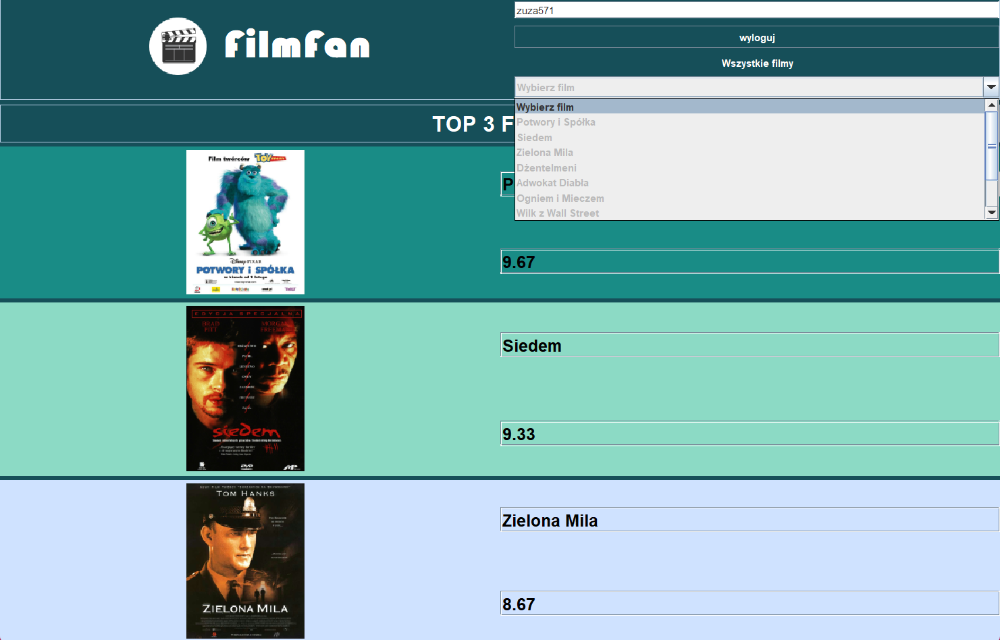
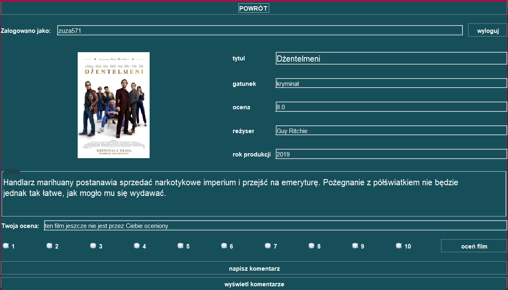

# FilmFan

## Table of contents
* [General info](#general-info)
* [Features](#features)
* [Technologies](#technologies)
* [Authors](#authors)

## General info
FilmFun is a simple GUI movie portal. It can be used for searching and rating movies.

## Features
- Signing Up 
- Signing In
- Logging Out

- Top 3 movies
- Searching for movie which interests you

- Rating the movie
- Displaying all movie's details

## Technologies
App was created with:
- Java 
- Serializable Interface 
- Swing

## Authors 
- [Zuzanna Pietrzak](https://github.com/zuza571)
- [Jakub Mazur](https://github.com/JakubMazur965)
